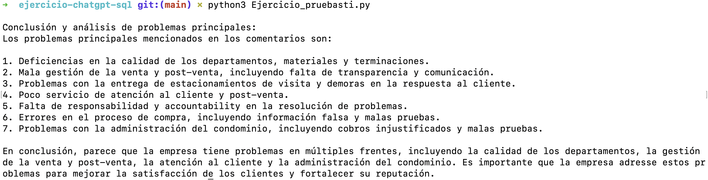
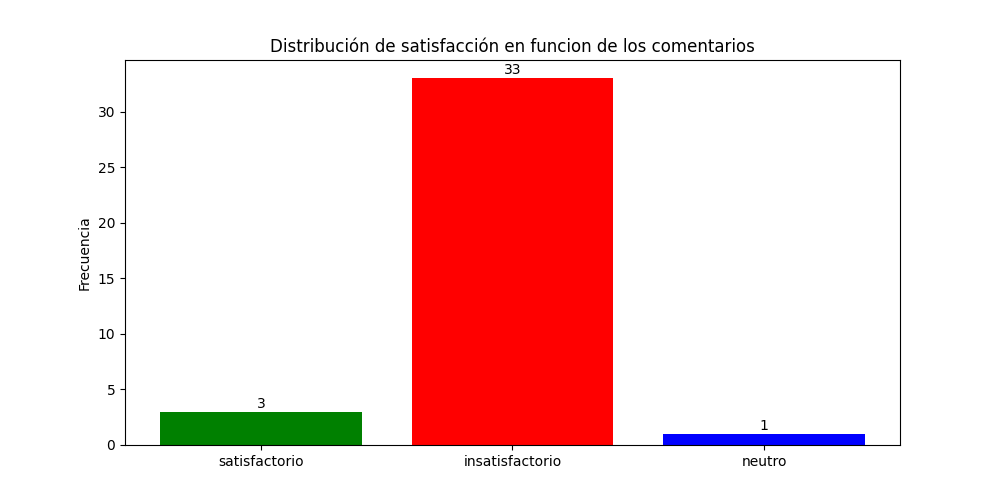

# Ejercicio de prueba de programacion usando chatGPT, MySQL, Pandas, Numpy Y Matplotlib

**El objetivo es leer una tabla en MySql y procesarla usando librerias de python y devolver imagenes y datos.**

**Entre \* aparece la clasificacion realizada por chatGPT del comentario extraido de la base de datos SQL**

**Resumen de las principales criticas sobre el servicio en base a los comentarios extraidos de la base de datos SQL**

