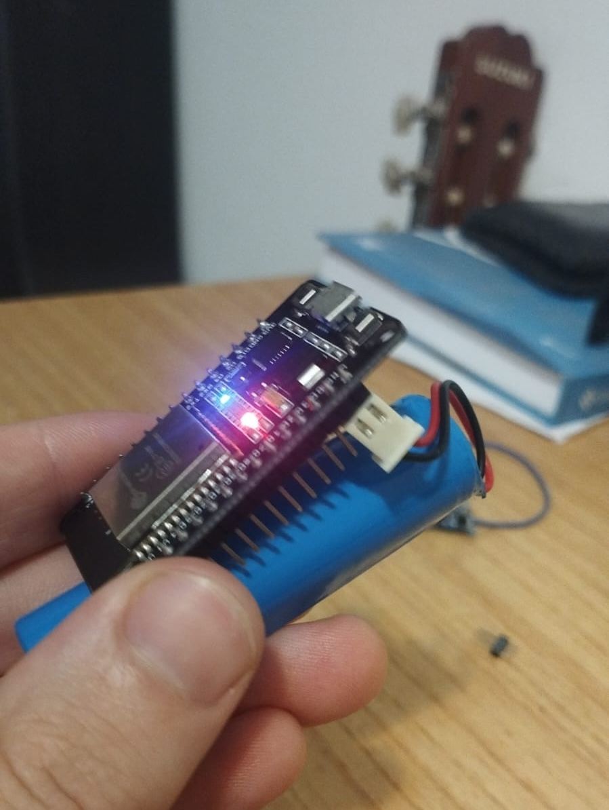
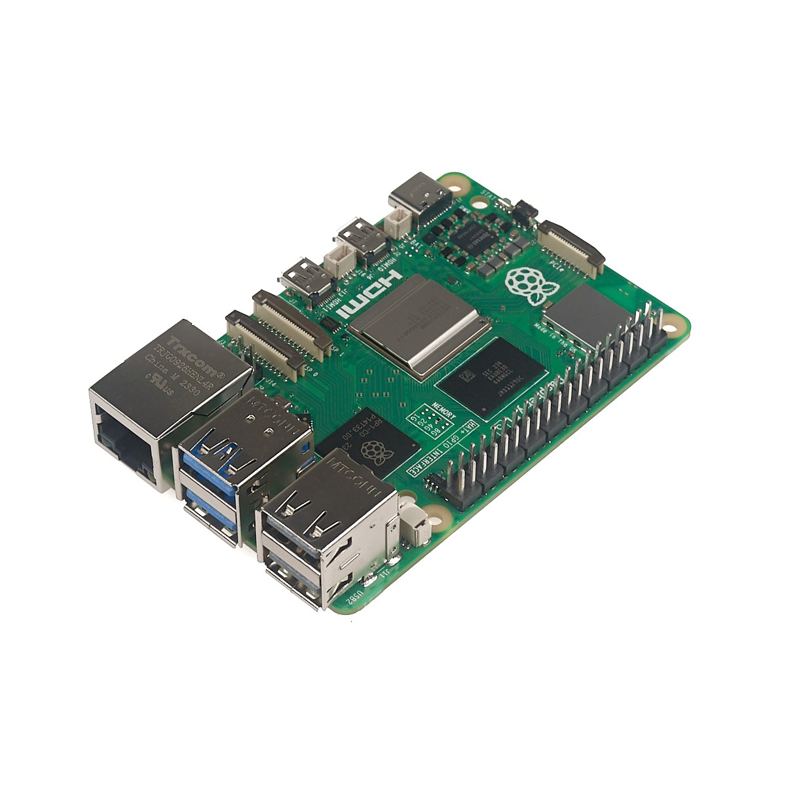

# Proyecto ESP32 MQTT Sensor Hub
<p align="center">
  
</p>

<p align="center">
  
  
</p>

Este proyecto desarrolla un sistema para ESP32 utilizando Arduino IDE que permite la lectura de varios sensores y la publicación de datos en un broker MQTT alojado en una Raspberry Pi.

## Descripción

El proyecto consiste en un software para ESP32 que facilita la lectura de diferentes tipos de sensores, como sensores de temperatura, humedad, y movimiento. Los datos recolectados son enviados a un servidor MQTT para su procesamiento y/o almacenamiento.

## Características

- Soporte para múltiples tipos de sensores.
- Configuración flexible a través de WiFi para la conexión a la red y la configuración del servidor MQTT.
- Gestión de la publicación de datos mediante el protocolo MQTT.
- Documentación completa y ejemplos de uso.

## Instalación

1. **Configuración del entorno de desarrollo:**
   - Descarga e instala Arduino IDE.
   - Instala el soporte para ESP32 en Arduino IDE. [Instrucciones aquí](https://programarfacil.com/esp8266/programar-esp32-ide-arduino/).
   
2. **Clonar el repositorio:**
   ```bash
   git clone git@github.com:franco210/JuanLivingSensorTemperature.git
   ```

3. **Configuración del proyecto:**
   - Abre el archivo `config.h` y configura los detalles de la red WiFi y del servidor MQTT.

4. **Cargar el firmware en el ESP32:**
   - Conecta tu ESP32 a tu computadora y selecciona la placa correcta y puerto en Arduino IDE.
   - Carga el firmware en el ESP32.

## Uso

1. **Conexión y configuración:**
   - Al encender, el ESP32 se conectará automáticamente a la red WiFi configurada.
   - Se iniciará la publicación de datos a través del servidor MQTT configurado.

2. **Visualización de datos:**
   - Para visualizar los datos publicados, accede al servidor MQTT. [Documentación de EMQ X MQTT](https://www.emqx.com/en/blog/esp32-connects-to-the-free-public-mqtt-broker).
   - Utiliza herramientas de suscripción MQTT como MQTT Explorer o MQTT.fx para visualizar y monitorear los datos.

## Contribuciones

Si deseas contribuir a este proyecto, por favor abre un *issue* para discutir los cambios propuestos o realiza un *pull request*.

## Licencia

Este proyecto está bajo la Licencia MIT. Consulta el archivo `LICENSE` para más detalles.
